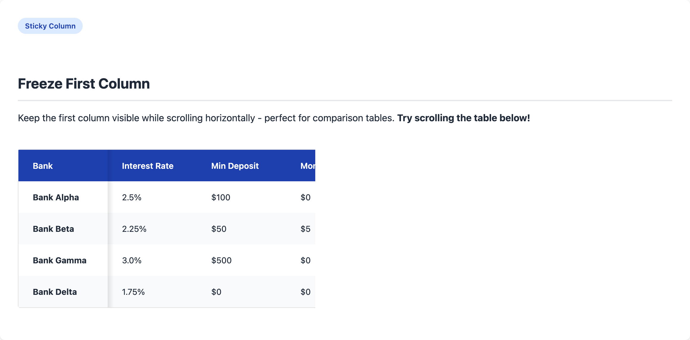

# Extending the WordPress Core Table Block: A Complete Guide

Learn how to extend the WordPress Gutenberg table block with custom styling options, sticky columns, and CTA buttons without creating a new block from scratch.



## Table of Contents

- [Introduction](#introduction)
- [Why Extend Instead of Create?](#why-extend-instead-of-create)
- [Architecture Overview](#architecture-overview)
- [Implementation Deep Dive](#implementation-deep-dive)
  - [Part 1: Adding Custom Attributes](#part-1-adding-custom-attributes)
  - [Part 2: Creating Inspector Controls](#part-2-creating-inspector-controls)
  - [Part 3: Frontend Styles](#part-3-frontend-styles)
  - [Part 4: Shortcodes for Advanced Features](#part-4-shortcodes-for-advanced-features)
- [Live Demo](#live-demo)
- [Installation](#installation)
- [Usage Guide](#usage-guide)
- [Integration with Headless WordPress](#integration-with-headless-wordpress)

---

## Introduction

WordPress's Gutenberg editor comes with a solid table block, but it often lacks the customization options needed for real-world projects. Instead of building a custom table block from scratch, we can extend the core block using WordPress's powerful filter system.

This approach gives us:
- **Header color themes** (Primary, Dark, Light, Success, Warning)
- **Sticky first column** for horizontal scrolling
- **Minimum cell width** control
- **Borderless option** for cleaner designs
- **CTA buttons** inside table cells
- **Custom cell width** control via shortcodes

## Why Extend Instead of Create?

Building a custom block from scratch means:
- Recreating all the table editing logic
- Maintaining compatibility with WordPress updates
- Duplicating accessibility features
- More code to maintain

By extending the core block, we:
- Leverage WordPress's battle-tested table editor
- Get automatic updates and improvements
- Maintain full compatibility with themes
- Write minimal code focused on our customizations

## Architecture Overview

The plugin follows modern PHP 8.1+ OOP standards with PSR-4 autoloading:

```
wp-table-block-extended/
├── wp-table-block-extended.php     # Bootstrap & autoloader
├── src/
│   ├── Plugin.php                  # Main plugin class (Singleton)
│   ├── Assets.php                  # Script/style enqueueing
│   └── Shortcodes/
│       ├── AbstractShortcode.php   # Base shortcode class
│       ├── CTA.php                 # CTA button shortcode
│       └── Placeholder.php         # Cell width shortcode
├── src/                            # JavaScript source
│   ├── index.js                    # Editor customizations
│   ├── editor.scss                 # Editor styles
│   └── style.scss                  # Frontend styles
├── build/                          # Compiled assets
├── docs/                           # GitHub Pages demo
├── composer.json                   # PHP dev tools (optional)
└── package.json                    # JS build tools
```

### Key Design Patterns

| Pattern | Implementation | Purpose |
|---------|----------------|---------|
| **Singleton** | `Plugin::instance()` | Single plugin instance |
| **PSR-4 Autoloading** | Namespaced classes | Auto-load classes on demand |
| **Separation of Concerns** | Assets, Shortcodes classes | Each class has one responsibility |
| **Abstract Base Class** | `AbstractShortcode` | Shared shortcode functionality |

### How It Works

1. **Filter Hooks**: We use `blocks.registerBlockType` to add custom attributes and `editor.BlockEdit` to inject our controls
2. **Class-Based Styling**: Toggle controls add/remove CSS classes to the block
3. **PHP Shortcodes**: OOP shortcode classes handle CTA buttons and cell width placeholders
4. **CSS Custom Properties**: Make the styles easily customizable

---

## Implementation Deep Dive

### Part 1: Adding Custom Attributes

First, we hook into block registration to add our custom attributes:

```javascript
import { addFilter } from '@wordpress/hooks';

function addTableBlockAttributes(settings) {
    // Only modify the core/table block
    if (settings.name !== 'core/table') {
        return settings;
    }

    // Add custom attribute for header color
    settings.attributes = {
        ...settings.attributes,
        headerBackgroundColor: {
            type: 'string',
            default: 'primary',
        },
    };

    // Remove default stripes style (we apply it automatically)
    if (settings.styles) {
        settings.styles = settings.styles.filter(
            (style) => style.name !== 'stripes'
        );
    }

    return settings;
}

addFilter(
    'blocks.registerBlockType',
    'wtbe/add-table-attributes',
    addTableBlockAttributes
);
```

**Key Points:**
- The `blocks.registerBlockType` filter runs when any block is registered
- We check for `core/table` to only modify the table block
- New attributes extend the existing ones without overwriting
- We can also modify the available block styles

### Part 2: Creating Inspector Controls

Next, we wrap the block's edit component to add our custom controls:

```javascript
import { InspectorControls } from '@wordpress/block-editor';
import { PanelBody, SelectControl, ToggleControl } from '@wordpress/components';
import { addFilter } from '@wordpress/hooks';

function TableBlockEdit({ BlockEdit, ...props }) {
    // Skip non-table blocks
    if (props.name !== 'core/table') {
        return <BlockEdit {...props} />;
    }

    const { attributes, setAttributes } = props;

    // Helper to toggle CSS classes
    function handleClassToggle(checked, classToToggle) {
        let newClassName = attributes?.className?.trim() || '';
        // Remove the class if it exists
        newClassName = newClassName.replace(
            new RegExp(`\\s?${classToToggle}`),
            ''
        );
        // Add it back if checked
        if (checked) {
            newClassName = `${newClassName} ${classToToggle}`.trim();
        }
        setAttributes({ className: newClassName });
    }

    // Parse current state from className
    const className = attributes?.className || '';
    const freezeFirstColumn = className.includes('wtbe-freeze-first-col');
    const noBorders = className.includes('wtbe-no-borders');

    return (
        <>
            <BlockEdit {...props} />
            <InspectorControls>
                <PanelBody title="Table Style Options" initialOpen={true}>
                    <ToggleControl
                        label="Freeze First Column"
                        checked={freezeFirstColumn}
                        onChange={(checked) =>
                            handleClassToggle(checked, 'wtbe-freeze-first-col')
                        }
                        help="Keep the first column visible when scrolling"
                    />
                    <ToggleControl
                        label="Remove Borders"
                        checked={noBorders}
                        onChange={(checked) =>
                            handleClassToggle(checked, 'wtbe-no-borders')
                        }
                    />
                </PanelBody>
            </InspectorControls>
        </>
    );
}

// Higher-order component wrapper
function addCustomControlsToTableBlock(BlockEdit) {
    return (props) => <TableBlockEdit BlockEdit={BlockEdit} {...props} />;
}

addFilter(
    'editor.BlockEdit',
    'wtbe/table-inspector-controls',
    addCustomControlsToTableBlock
);
```

**Key Points:**
- `editor.BlockEdit` filter wraps the edit component
- We render the original `<BlockEdit>` plus our controls
- State is stored in `className` attribute (persisted automatically)
- We parse the class string to determine toggle states

### Part 3: Frontend Styles

The CSS uses custom properties for easy customization:

```scss
:root {
    --wtbe-cell-padding-x: 24px;
    --wtbe-cell-padding-y: 16px;
    --wtbe-header-primary: #1e40af;
    --wtbe-header-dark: #1f2937;
    --wtbe-row-odd: #ffffff;
    --wtbe-row-even: #f9fafb;
}

.wp-block-table {
    font-size: 14px;
    overflow-x: auto;

    table {
        border: 1px solid #e0e0e0;
        border-radius: 4px;
        border-collapse: separate;
    }

    th {
        background: var(--wtbe-header-primary);
        color: white;
        padding: var(--wtbe-cell-padding-y) var(--wtbe-cell-padding-x);
    }

    // Zebra stripes
    tbody tr:nth-of-type(odd) td {
        background-color: var(--wtbe-row-odd);
    }
    tbody tr:nth-of-type(even) td {
        background-color: var(--wtbe-row-even);
    }

    // Header color variants
    &.wtbe-header-bg-dark th {
        background-color: var(--wtbe-header-dark);
    }

    // Sticky first column
    &.wtbe-freeze-first-col {
        th:first-child,
        td:first-child {
            position: sticky;
            left: 0;
            z-index: 2;

            &::after {
                content: '';
                position: absolute;
                top: 0;
                bottom: 0;
                left: 100%;
                width: 10px;
                background: linear-gradient(
                    to right,
                    rgba(0,0,0,0.1),
                    transparent
                );
            }
        }
    }
}
```

**Key Points:**
- CSS custom properties allow theme customization
- Class-based modifiers match the toggle controls
- Sticky positioning with shadow creates the "freeze" effect
- `border-collapse: separate` enables border-radius

### Part 4: Shortcodes for Advanced Features

For features that need dynamic HTML, we use PHP shortcodes:

```php
/**
 * CTA button shortcode for table cells
 * Usage: [wtbe_cta url="https://example.com" label="Learn More"]
 */
function wtbe_cta_shortcode($atts) {
    $atts = shortcode_atts(
        array(
            'url'       => '#',
            'label'     => 'Click Here',
            'newtab'    => 'true',
            'nofollow'  => 'false',
            'sponsored' => 'false',
        ),
        $atts
    );

    $newtab = filter_var($atts['newtab'], FILTER_VALIDATE_BOOLEAN);
    $nofollow = filter_var($atts['nofollow'], FILTER_VALIDATE_BOOLEAN);

    $rel_parts = array();
    if ($nofollow) $rel_parts[] = 'nofollow';
    if ($newtab) {
        $rel_parts[] = 'noopener';
        $rel_parts[] = 'noreferrer';
    }

    return sprintf(
        '<a href="%s"%s class="wtbe-cta"%s>%s</a>',
        esc_url($atts['url']),
        $newtab ? ' target="_blank"' : '',
        !empty($rel_parts) ? ' rel="' . implode(' ', $rel_parts) . '"' : '',
        esc_html($atts['label'])
    );
}
add_shortcode('wtbe_cta', 'wtbe_cta_shortcode');

/**
 * Placeholder shortcode for forcing cell width
 * Usage: [wtbe_placeholder width="300px"]
 */
function wtbe_placeholder_shortcode($atts) {
    $atts = shortcode_atts(array('width' => ''), $atts);

    if (empty($atts['width'])) {
        return '<div style="background:#ffb6b6;padding:4px;">
            Error: width is required
        </div>';
    }

    $width = $atts['width'];
    if (is_numeric($width)) $width .= 'px';

    // Account for cell padding
    $calc_width = 'calc(' . $width . ' - (2 * var(--wtbe-cell-padding-x)))';

    return '<div style="width:' . esc_attr($calc_width) . ';height:0;"></div>';
}
add_shortcode('wtbe_placeholder', 'wtbe_placeholder_shortcode');
```

**Key Points:**
- Shortcodes allow complex HTML in table cells
- `shortcode_atts` provides defaults and sanitization
- Boolean attributes need explicit conversion
- The placeholder uses an invisible div to force width

---

## Live Demo

Open `demo/demo.html` in your browser to see all features in action, including:

- Default table with zebra stripes
- All header color variants
- Sticky first column (horizontal scroll)
- CTA buttons in cells
- Borderless tables
- Centered headers

---

## Installation

### For Users (Simple)

1. Download or clone the repository
2. Run `npm install && npm run build` to compile assets
3. Upload the plugin folder to `/wp-content/plugins/`
4. Activate "WP Table Block Extended" in WordPress

**Note:** Composer is NOT required for users. The plugin works out of the box!

### For Developers

```bash
# Install JavaScript dependencies (required)
npm install

# Start development mode (watches for changes)
npm run start

# Build for production
npm run build

# Lint JavaScript and CSS
npm run lint
npm run lint:fix
```

---

## Development Tools (Optional)

### Why Composer? (Optional for Developers)

This plugin includes a `composer.json` for developers who want additional code quality tools. **Composer is completely optional** - the plugin works perfectly without it.

| Tool | Purpose | Command |
|------|---------|---------|
| **PHPCS** | Checks code follows WordPress Coding Standards | `composer phpcs` |
| **PHPStan** | Static analysis - finds bugs without running code | `composer phpstan` |

### What is Static Analysis?

Static analysis examines your code *without executing it* to find potential bugs:

```php
function add(int $a, int $b): int {
    return $a + $b;
}

add("hello", "world"); // PHPStan catches this: "Parameter #1 expects int, string given"
```

**Benefits:**
- Catches type errors before runtime
- Finds undefined variables and methods
- Identifies dead/unreachable code
- Detects null pointer issues

### Setting Up Dev Tools (Optional)

```bash
# Install PHP dev dependencies
composer install

# Run code style check (WordPress Coding Standards)
composer phpcs

# Auto-fix code style issues
composer phpcbf

# Run static analysis (catches bugs without running code)
composer phpstan
```

### Why is Composer Optional?

1. **WordPress core doesn't use Composer** - We follow WP conventions
2. **No external PHP dependencies** - Plugin is self-contained
3. **Built-in autoloader** - PSR-4 autoloading works without Composer
4. **Dev tools only** - Composer is only needed for PHPCS/PHPStan

---

## Usage Guide

### In the Block Editor

1. Add a Table block to your post
2. Open the block settings sidebar
3. Find "Table Style Options" panel
4. Configure your preferred options:
   - **Header Background Color**: Choose a theme color
   - **Remove Table Borders**: Toggle outer border
   - **Minimum Cell Width**: Ensure cells don't get too narrow
   - **Freeze First Column**: Keep first column visible on scroll
   - **Center Header Text**: Center-align header cells

### Using Shortcodes

#### CTA Button

```
[wtbe_cta url="https://example.com" label="Sign Up" nofollow="true"]
```

| Attribute | Description | Default |
|-----------|-------------|---------|
| `url` | Link destination | `#` |
| `label` | Button text | `Click Here` |
| `newtab` | Open in new tab | `true` |
| `nofollow` | Add nofollow | `false` |
| `sponsored` | Add sponsored | `false` |

#### Cell Width Placeholder

```
[wtbe_placeholder width="250px"]
```

Add this shortcode to a cell to force a minimum width.

---

## Integration with Headless WordPress

When using WordPress as a headless CMS with Next.js or similar:

### 1. Include the Styles

The table styles need to be included in your frontend. You can:

**Option A**: Copy `src/style.scss` to your Next.js project and import it:

```jsx
// app/layout.js or _app.js
import '@/styles/table-block.css';
```

**Option B**: Fetch styles from WordPress REST API and inject them:

```jsx
// In your page component
<style dangerouslySetInnerHTML={{ __html: tableStyles }} />
```

### 2. Process Shortcodes

The shortcodes are processed server-side by WordPress. When fetching content via REST API or GraphQL, the shortcodes will already be converted to HTML.

If you're using raw block content, you'll need to handle shortcode conversion in your frontend:

```javascript
// Simple shortcode parser for [wtbe_cta]
function parseTableCta(content) {
    return content.replace(
        /\[wtbe_cta([^\]]*)\]/g,
        (match, attrs) => {
            const url = attrs.match(/url="([^"]+)"/)?.[1] || '#';
            const label = attrs.match(/label="([^"]+)"/)?.[1] || 'Click Here';
            return `<a href="${url}" class="wtbe-cta" target="_blank" rel="noopener">${label}</a>`;
        }
    );
}
```

### 3. Handle Sticky Columns

The sticky column feature uses CSS `position: sticky`. Ensure your container doesn't have `overflow: hidden` which would break the sticky behavior:

```css
.article-content {
    /* Don't use overflow: hidden on the table container */
    overflow-x: auto; /* Allow horizontal scroll */
}
```

---

## Customization

Override CSS custom properties in your theme:

```css
:root {
    --wtbe-header-primary: #your-brand-color;
    --wtbe-cta-bg: #your-button-color;
    --wtbe-cell-padding-x: 16px;
    --wtbe-cell-padding-y: 12px;
}
```

---

## Browser Support

- Chrome/Edge (latest)
- Firefox (latest)
- Safari (latest)
- Mobile browsers

The sticky column feature requires CSS `position: sticky` support (all modern browsers).

---

## License

GPL-2.0-or-later

---

## Author

**Firas Codes**
[firascodes.ca](https://www.firascodes.ca) | [GitHub](https://github.com/firasdeveloper)
